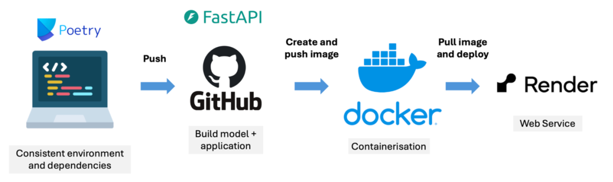

# Precipitation Forecasting API
 
A deployed REST API serving two XGBoost weather models — predicting 3-day cumulative precipitation and 7-day rain occurrence, containerised with Docker and live on Render.
 
**Live API:** https://adv-mla-at2-25552249.onrender.com
 
**Model training repository:** [adv_mla_at2](https://github.com/Shawynot33/adv_mla_at2)
 
 
## Overview
 
This repository contains the API backend for two precipitation forecasting tasks:
 
1. **Precipitation sum over the next three days** (regression)
2. **Rain occurrence seven days ahead** (classification)
 
Real-time weather inputs are retrieved via the [Open-Meteo API](https://open-meteo.com/), enabling live predictions without manual data entry.


## Repository Structure
```
├── app/                        
│   ├── app.py           <- FastAPI routes and user interaction  
│   └── main.py          <- Functions handling API logic and responses  
│
├── models/                  
│   ├── xgb_model_clf    <- Saved XGBoost classification model (rain occurrence 7 days ahead)  
│   └── xgb_model_reg    <- Saved XGBoost regression model (precipitation sum next 3 days)  
│
├── .DS_Store  
├── .cache.sqlite  
├── .python-version  
├── Dockerfile           <- Docker configuration for deployment  
├── github.txt  
├── poetry.lock          <- Poetry dependency lock file  
├── pyproject.toml       <- Poetry configuration  
└── requirements.txt     <- Python dependencies  
```

## Modelling Approach
 
Both models were trained using **XGBoost** — chosen for its strong performance on tabular data and flexibility for both regression and classification tasks.
 
**Training pipeline:**
- Time-series split (N=5) applied to preserve temporal ordering across folds, ensuring validation sets simulate future unseen data
- Hyperparameter tuning via **Hyperopt** (Bayesian optimisation, 50 iterations), minimising average validation loss across all folds
- Best parameters used to refit on the full training set, with final evaluation on a held-out **2024 test set**
 
The workflow diagram below illustrates the process:
 

 
 
## Model Performance
 
### Regression: 3-Day Precipitation Sum
 
| Metric | Validation | Test | Baseline |
|--------|------------|------|----------|
| RMSE   | 14.15      | 13.98 | 14.83   |
| MAE    | 7.25       | 8.18  | 8.97    |
| R²     | —          | 0.10  | -0.01   |
 
> Precipitation forecasting is inherently high-variance. RMSE and MAE improvements over the mean baseline are the most meaningful indicators of model utility here.
 
### Classification: 7-Day Rain Occurrence
 
| Metric       | Validation | Test  | Baseline |
|--------------|------------|-------|----------|
| F1-score     | 0.725      | 0.660 | 0.763    |
| Weighted F1  | —          | 0.630 | 0.471    |
| Accuracy     | —          | 0.603 | 0.617    |
| ROC-AUC      | 0.635      | 0.668 | 0.500    |
 
> ROC-AUC of 0.668 vs. a 0.500 random baseline reflects meaningful discriminative ability. F1 is sensitive to class imbalance in rain occurrence data and threshold selection.


## Deployment
 
The model was deployed using a structured pipeline: **Poetry** manages dependencies for a consistent environment, the application is built with **FastAPI** and pushed to **GitHub**, containerised as a **Docker** image, and served as a web service on **Render**.
 

 
**Future improvements:**
- CI/CD pipelines for automated testing and redeployment
- Logging and monitoring tools to track prediction quality over time
- Cloud-based scaling for higher-demand scenarios
- Scheduled retraining as weather patterns evolve
 
---
 
## API Endpoints
 
All endpoints are accessed via **GET** requests.
 
### `GET /`
Displays project objectives, available endpoints, expected inputs, output format, and a link to the training repository.
 
### `GET /health/`
Returns status code `200` with a welcome message.
 
### `GET /predict/rain/`
Returns whether it will rain exactly **7 days** after the input date.
 
**Parameters:**
- `date` — format: `YYYY-MM-DD`
 
**Example request:**
```json
{ "date": "2023-01-01" }
```
 
**Example response:**
```json
{
  "input_date": "2023-01-01",
  "prediction": {
    "date": "2023-01-08",
    "will_rain": true
  }
}
```
 
### `GET /predict/precipitation/fall/`
Returns the cumulative precipitation sum over the **next 3 days** from the input date.
 
**Parameters:**
- `date` — format: `YYYY-MM-DD`
 
**Example request:**
```json
{ "date": "2023-01-01" }
```
 
**Example response:**
```json
{
  "input_date": "2023-01-01",
  "prediction": {
    "start_date": "2023-01-02",
    "end_date": "2023-01-04",
    "precipitation_fall": 28.2
  }
}
```
 
---
 
## Installation & Setup
 
1. **Clone the repository:**
```bash
git clone https://github.com/Shawynot33/precipitation_forecast_api/
cd adv_mla_at2_api
```
 
2. **Install dependencies:**
```bash
# Using Poetry
poetry install
 
# Or using pip
pip install -r requirements.txt
```
 
3. **Run the API locally:**
```bash
uvicorn app.main:app --reload
```
